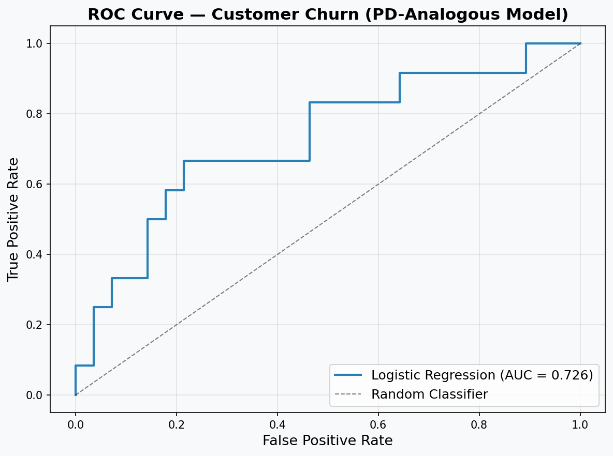

# Customer Churn Prediction (PD-Analogous Logistic Regression)

A logistic regression model predicting customer churn for a telecommunications company. Methodologically, this is the same modeling problem as **Probability of Default (PD)** estimation in credit risk: a logistic regression producing a calibrated probability of a binary adverse event, evaluated on discrimination and interpreted through coefficients and odds ratios.

---

## Relevance to Credit Risk Modeling

Churn modeling and credit default (PD) modeling are the same mathematical object — both estimate the probability of a binary adverse event using logistic regression, the workhorse method behind credit scorecards. The techniques demonstrated here (probability estimation, ROC-AUC discrimination, coefficient/odds-ratio interpretation) transfer directly to PD modeling and model validation.

---

## Dataset

- Telecommunications customer dataset (loaded directly from URL — no manual download required)
- Features: tenure, age, address, income, education, employment, equipment, and service usage
- Target: `churn` (binary — whether the customer left in the last month)

---

## Workflow

### 1. Data Preprocessing
- Selected demographic and account features
- Standardized features using `StandardScaler`
- Stratified train/test split (80/20)

### 2. Modeling
- Logistic regression with L2 regularization (`C=0.01`)
- Compared `liblinear` and `sag` solvers
- Generated class probabilities via `predict_proba` — the churn probability is directly analogous to PD

### 3. Model Evaluation
- **Model Discrimination: ROC-AUC** — the standard discrimination metric in credit scoring, with ROC curve visualization
- **Churn Drivers: Coefficient Interpretation & Odds Ratios** — feature-level interpretation in the form expected by scorecard reviewers
- Confusion matrix and classification report
- Log loss for probability calibration assessment

---


## Results



The ROC-AUC quantifies the model's ability to discriminate churners from non-churners.

**Churn Drivers (Coefficient Interpretation):**

The strongest predictors of churn were tenure, employment length, and age — all with negative coefficients (odds ratios below 1), indicating that longer-tenured, longer-employed, and older customers are less likely to churn. Equipment usage had the largest positive effect (odds ratio ~1.13), meaning customers with equipment service were modestly more likely to churn. This direction-of-effect interpretation via odds ratios mirrors how credit scorecards are reviewed in model validation.

---

## Requirements

```bash
pip install pandas numpy scipy scikit-learn matplotlib
```

---

## Technologies Used

- Python, Pandas, NumPy, SciPy, Matplotlib
- scikit-learn: `LogisticRegression`, `StandardScaler`, `roc_auc_score`, `roc_curve`, `confusion_matrix`, `classification_report`, `log_loss`